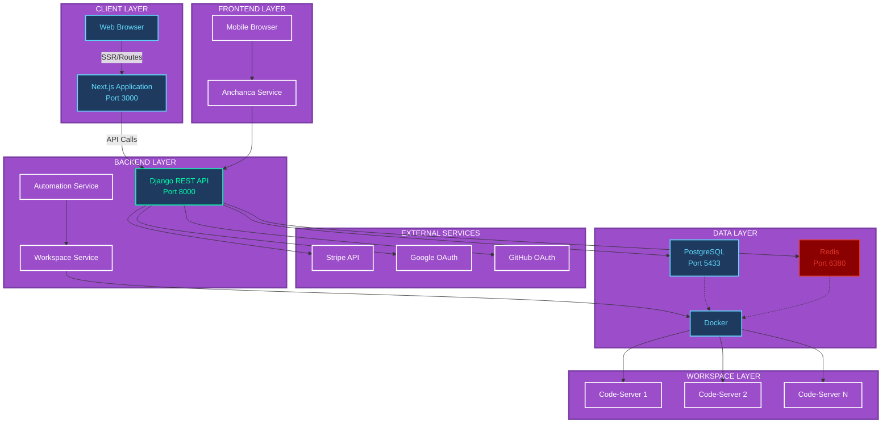
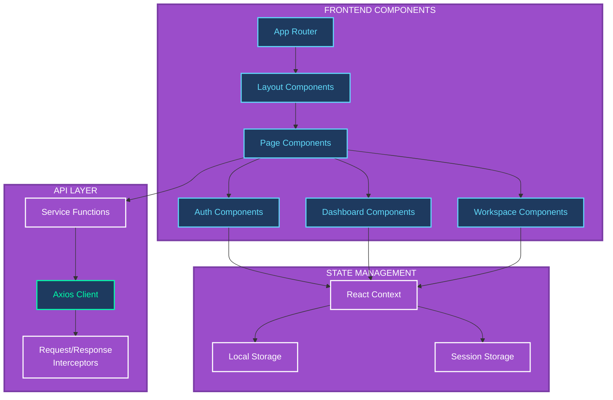
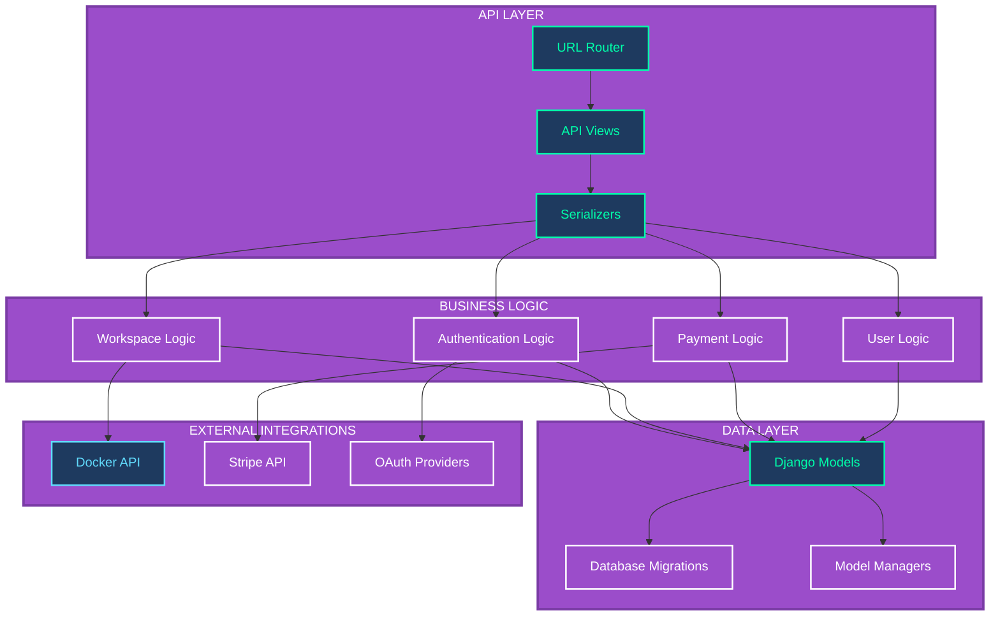
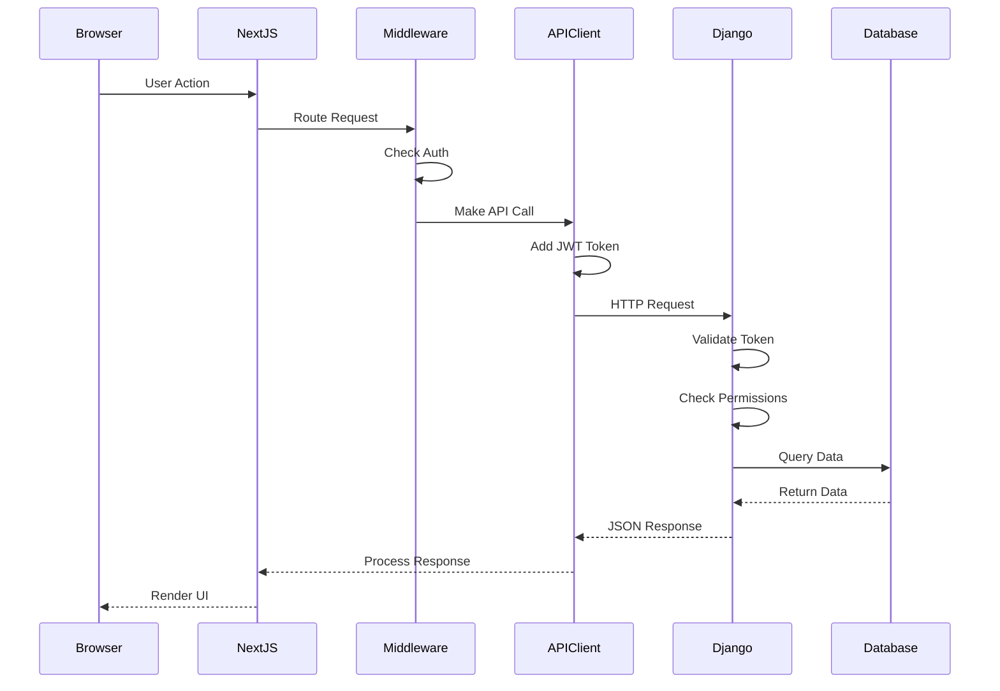
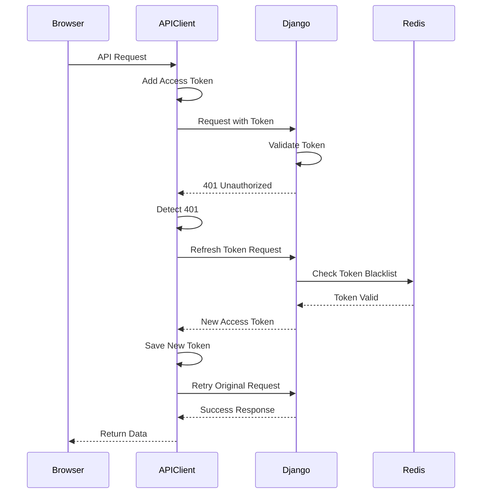
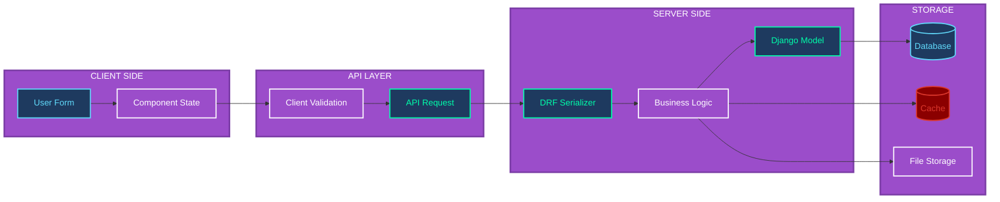
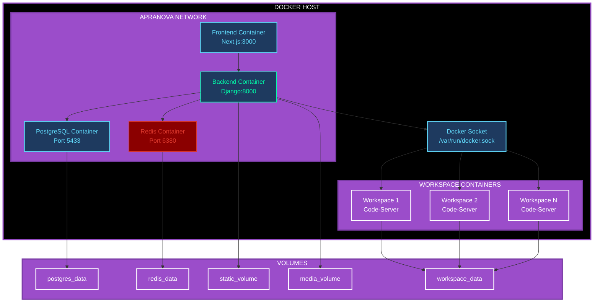
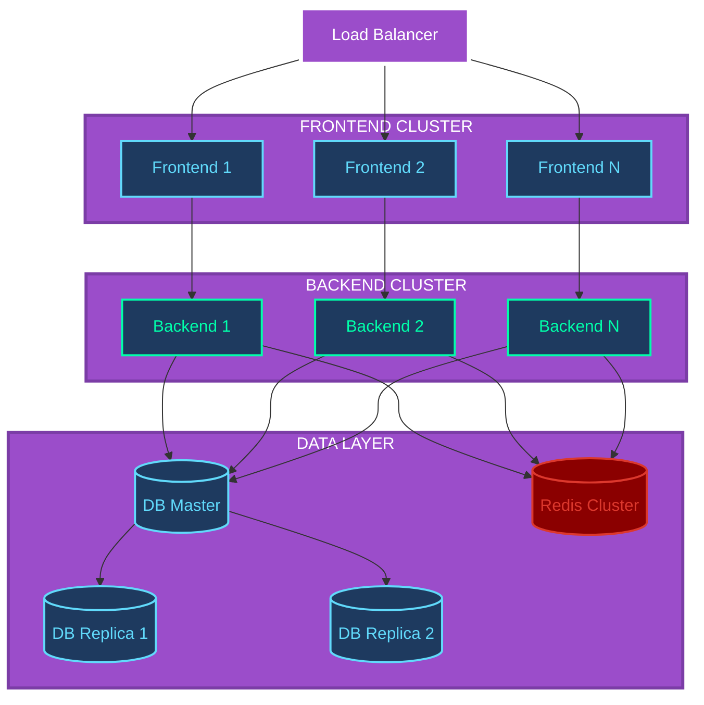

  <h1 style="font-size: 3em; margin-bottom: 10px; background: linear-gradient(135deg, #3498db 0%, #2980b9 100%); -webkit-background-clip: text; -webkit-text-fill-color: transparent; background-clip: text;">🏗️ System Architecture</h1>
  

    Complete architectural overview of the ApraNova Learning Management System
  

  <h3 style="margin-top: 0; color: white; font-size: 1.6em;">📋 Architecture Overview</h3>
  

    ApraNova follows a <strong>modern microservices architecture</strong> with clear separation of concerns.
    The system is built on a <strong>3-tier architecture</strong> (Presentation, Application, Data) with
    Docker containerization for scalability and isolation.
  

---

## 🏗️ System Architecture Diagram

---

## 📦 Component Architecture

  <h3 style="margin-top: 0; color: #2c3e50; font-size: 1.5em;">⚛️ Frontend Architecture</h3>
  

    Built with <strong>Next.js 15.2.4</strong> using the App Router pattern. Features React 19 components,
    Context API for state management, and Axios for API communication with interceptors for authentication.
  

### Frontend Component Diagram

  <h3 style="margin-top: 0; color: white; font-size: 1.5em;">⚙️ Backend Architecture</h3>
  

    Powered by <strong>Django 5.2.7</strong> with Django REST Framework. Implements JWT authentication,
    Docker-in-Docker workspace provisioning, Stripe payment integration, and PostgreSQL + Redis for data persistence.
  

### Backend Component Diagram

---

## 🔄 Request Flow

### Standard API Request Flow

### Authenticated Request with Token Refresh

---

## 🗄️ Data Flow Architecture

---

## 🐳 Docker Architecture

---

## 🔌 Integration Points

### External Service Integration

| Service | Purpose | Integration Method |
|---------|---------|-------------------|
| **Stripe** | Payment Processing | REST API |
| **Google OAuth** | Social Authentication | OAuth 2.0 |
| **GitHub OAuth** | Social Authentication | OAuth 2.0 |
| **Docker Engine** | Workspace Provisioning | Docker SDK |
| **SMTP Server** | Email Notifications | SMTP Protocol |

### Internal Service Communication

| From | To | Protocol | Purpose |
|------|-----|----------|---------|
| Frontend | Backend | HTTP/HTTPS | API Requests |
| Backend | PostgreSQL | TCP | Database Queries |
| Backend | Redis | TCP | Caching |
| Backend | Docker | Unix Socket | Container Management |
| Next.js | Django | HTTP Proxy | SSR API Calls |

---

## 📊 Scalability Considerations

### Horizontal Scaling

---

## 🔒 Security Architecture

### Security Layers

1. **Network Layer**: CORS, HTTPS, Firewall rules
2. **Application Layer**: JWT validation, CSRF protection
3. **Data Layer**: Encrypted connections, password hashing
4. **Container Layer**: Isolated workspaces, resource limits

### Authentication Flow

See [Authentication Flow](./auth-flow.md) for detailed diagrams.

---

## 📈 Performance Optimization

### Caching Strategy

- **Redis Cache**: User sessions, API responses
- **Browser Cache**: Static assets, images
- **Database Cache**: Query result caching
- **CDN**: Static file delivery (production)

### Database Optimization

- **Indexes**: On frequently queried fields
- **Connection Pooling**: Reuse database connections
- **Query Optimization**: Select only needed fields
- **Lazy Loading**: Load related objects on demand

---

## 🔗 Related Documentation

- [Database Schema](./database-schema.md)
- [API Documentation](./api-documentation.md)
- [Deployment Guide](./deployment.md)

---

[← Back to Index](./index.md)

