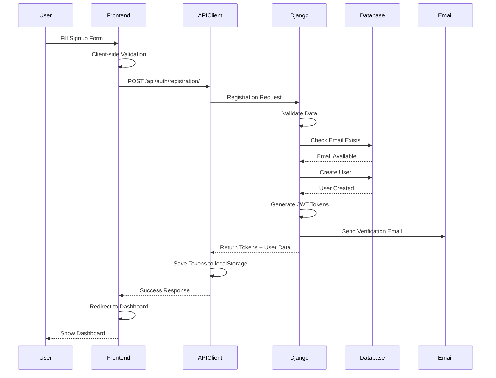
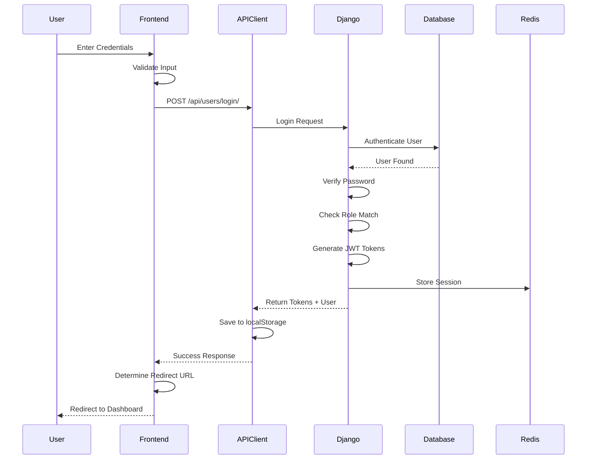
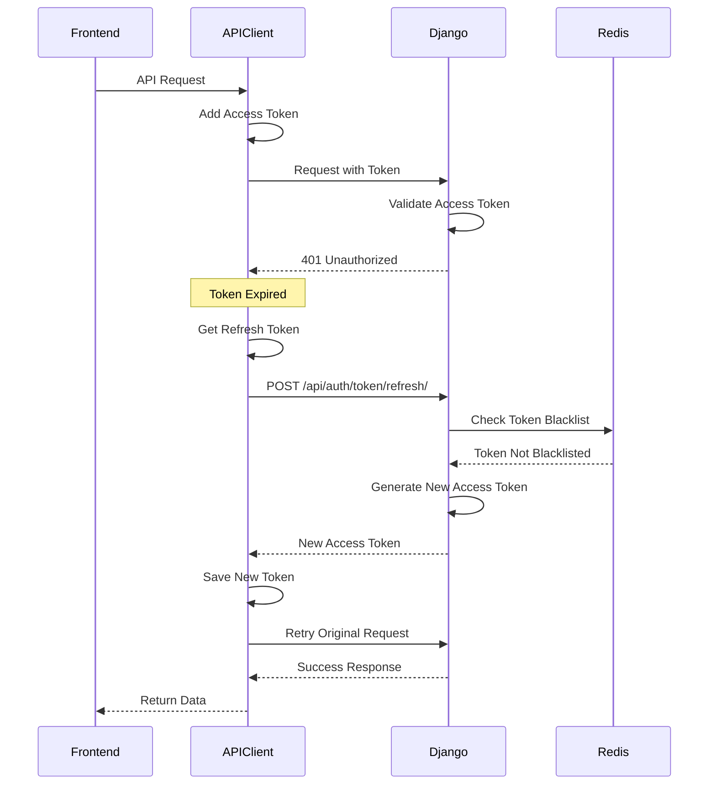
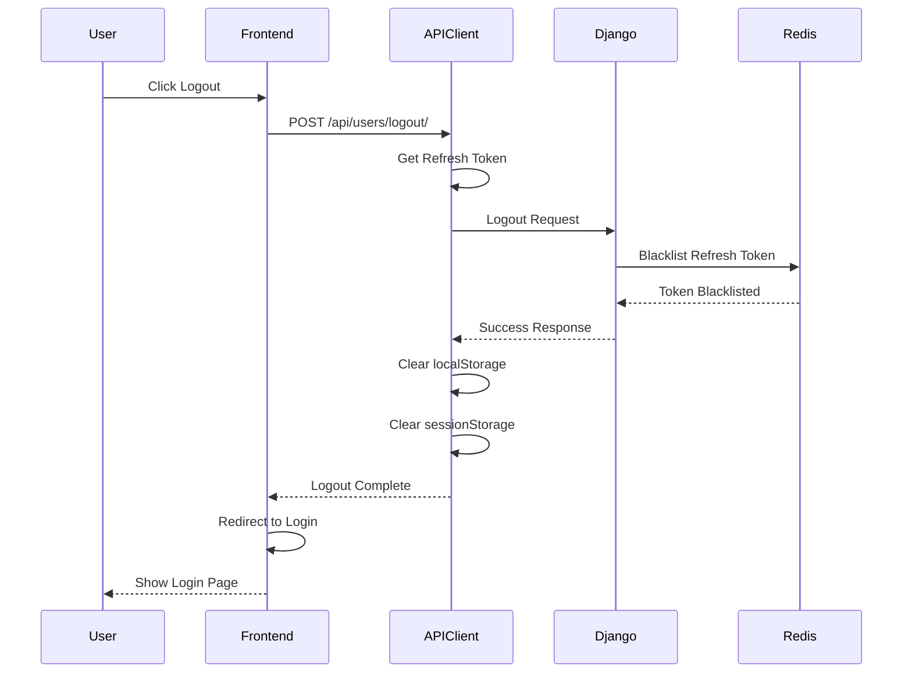
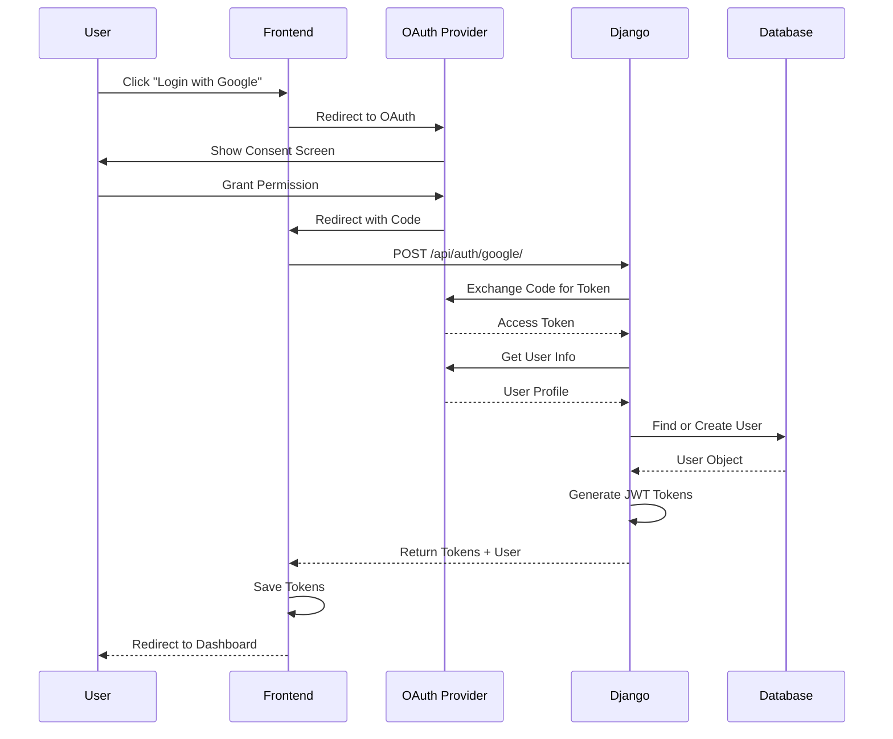
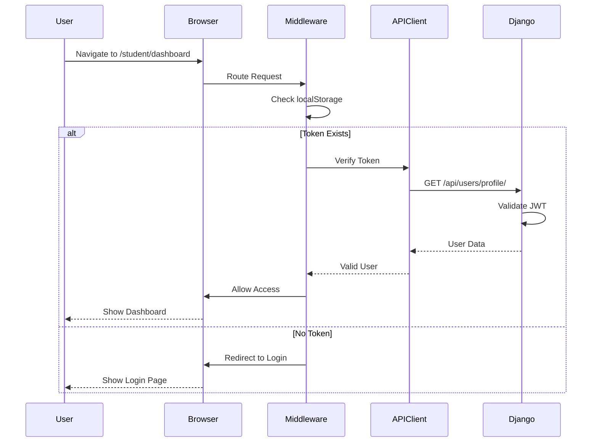
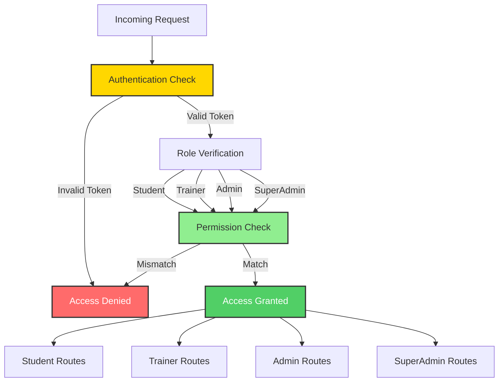
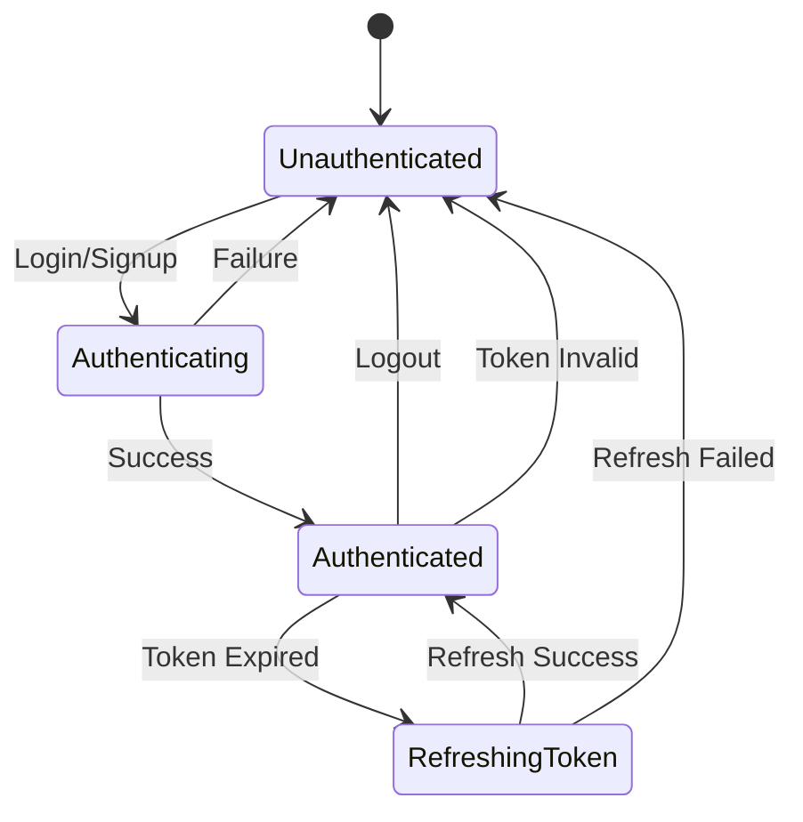

<div style="text-align: center; padding: 30px 0 20px 0;">
  <h1 style="font-size: 3em; margin-bottom: 10px; background: linear-gradient(135deg, #9b59b6 0%, #8e44ad 100%); -webkit-background-clip: text; -webkit-text-fill-color: transparent; background-clip: text;">🔐 Authentication Flow</h1>
  <p style="font-size: 1.2em; color: #7f8c8d; max-width: 700px; margin: 0 auto;">
    Complete authentication and authorization flow diagrams for ApraNova LMS
  </p>
</div>

<div style="background: linear-gradient(135deg, #9b59b6 0%, #8e44ad 100%); padding: 30px; border-radius: 12px; color: white; margin: 30px 0; box-shadow: 0 8px 25px rgba(155, 89, 182, 0.3);">
  <h3 style="margin-top: 0; color: white; font-size: 1.6em;">🔒 Authentication Overview</h3>
  <p style="font-size: 1.1em; line-height: 1.7; margin-bottom: 15px;">
    ApraNova implements a <strong>multi-layered authentication system</strong> with support for traditional
    credentials and social login providers.
  </p>
  <div style="display: grid; grid-template-columns: repeat(auto-fit, minmax(200px, 1fr)); gap: 15px; margin-top: 20px;">
    <div style="background: rgba(255,255,255,0.15); padding: 15px; border-radius: 8px; backdrop-filter: blur(10px);">
      <div style="font-size: 1.8em; margin-bottom: 5px;">📧</div>
      <div style="font-weight: 600;">Email/Password</div>
      <div style="font-size: 0.9em; opacity: 0.9;">Traditional credentials</div>
    </div>
    <div style="background: rgba(255,255,255,0.15); padding: 15px; border-radius: 8px; backdrop-filter: blur(10px);">
      <div style="font-size: 1.8em; margin-bottom: 5px;">🔑</div>
      <div style="font-weight: 600;">JWT Tokens</div>
      <div style="font-size: 0.9em; opacity: 0.9;">Stateless auth</div>
    </div>
    <div style="background: rgba(255,255,255,0.15); padding: 15px; border-radius: 8px; backdrop-filter: blur(10px);">
      <div style="font-size: 1.8em; margin-bottom: 5px;">🌐</div>
      <div style="font-weight: 600;">Google OAuth</div>
      <div style="font-size: 0.9em; opacity: 0.9;">Social login</div>
    </div>
    <div style="background: rgba(255,255,255,0.15); padding: 15px; border-radius: 8px; backdrop-filter: blur(10px);">
      <div style="font-size: 1.8em; margin-bottom: 5px;">🐙</div>
      <div style="font-weight: 600;">GitHub OAuth</div>
      <div style="font-size: 0.9em; opacity: 0.9;">Developer login</div>
    </div>
  </div>
</div>

---

## 📝 User Registration Flow

<div style="background: linear-gradient(135deg, #ffecd2 0%, #fcb69f 100%); padding: 20px; border-radius: 10px; margin: 20px 0;">
  <p style="margin: 0; color: #d35400; font-size: 1.05em;">
    <strong>📌 Note:</strong> New users register with email/password and receive a verification email.
    JWT tokens are issued immediately upon successful registration.
  </p>
</div>



### Registration Request

**Endpoint**: `POST /api/auth/registration/`

**Request Body**:
```json
{
  "name": "John Doe",
  "email": "john@example.com",
  "password1": "SecurePass123!",
  "password2": "SecurePass123!",
  "role": "student",
  "track": "DP"
}
```

**Response**:
```json
{
  "access": "eyJ0eXAiOiJKV1QiLCJhbGc...",
  "refresh": "eyJ0eXAiOiJKV1QiLCJhbGc...",
  "user": {
    "id": 1,
    "email": "john@example.com",
    "name": "John Doe",
    "role": "student",
    "track": "DP"
  }
}
```

---

## 🔑 Login Flow



### Login Request

**Endpoint**: `POST /api/users/login/`

**Request Body**:
```json
{
  "email": "john@example.com",
  "password": "SecurePass123!",
  "role": "student"
}
```

**Response**:
```json
{
  "access": "eyJ0eXAiOiJKV1QiLCJhbGc...",
  "refresh": "eyJ0eXAiOiJKV1QiLCJhbGc...",
  "user": {
    "id": 1,
    "email": "john@example.com",
    "name": "John Doe",
    "role": "student"
  },
  "redirect_url": "/student/dashboard"
}
```

---

## 🔄 Token Refresh Flow



### Token Refresh Request

**Endpoint**: `POST /api/auth/token/refresh/`

**Request Body**:
```json
{
  "refresh": "eyJ0eXAiOiJKV1QiLCJhbGc..."
}
```

**Response**:
```json
{
  "access": "eyJ0eXAiOiJKV1QiLCJhbGc...",
  "refresh": "eyJ0eXAiOiJKV1QiLCJhbGc..."
}
```

---

## 🚪 Logout Flow



---

## 🌐 OAuth Flow (Google/GitHub)



### OAuth Login Request

**Endpoint**: `POST /api/auth/google/` or `POST /api/auth/github/`

**Request Body**:
```json
{
  "code": "4/0AY0e-g7...",
  "redirect_uri": "http://localhost:3000/auth/callback"
}
```

**Response**:
```json
{
  "access": "eyJ0eXAiOiJKV1QiLCJhbGc...",
  "refresh": "eyJ0eXAiOiJKV1QiLCJhbGc...",
  "user": {
    "id": 1,
    "email": "john@gmail.com",
    "name": "John Doe",
    "role": "student"
  }
}
```

---

## 🛡️ Protected Route Access



---

## 🔐 Role-Based Access Control



### Role Hierarchy

| Role | Access Level | Permissions |
|------|-------------|-------------|
| **Student** | Basic | Own dashboard, workspace, submissions |
| **Trainer** | Elevated | Student management, grading, batch access |
| **Admin** | High | User management, system config, reports |
| **SuperAdmin** | Full | All permissions, can access any role |

---

## 🔒 Security Measures

### Token Security

1. **Access Token**: Short-lived (15 minutes)
2. **Refresh Token**: Long-lived (7 days)
3. **Token Blacklisting**: Logout invalidates tokens
4. **HTTPS Only**: Tokens transmitted over secure connection
5. **HttpOnly Cookies**: Optional cookie-based storage

### Password Security

1. **Hashing**: bcrypt with salt
2. **Minimum Length**: 8 characters
3. **Complexity**: Uppercase, lowercase, numbers, symbols
4. **Reset Flow**: Email-based password reset
5. **Rate Limiting**: Prevent brute force attacks

---

## 📊 Authentication State Management



---

## 🔗 Related Documentation

- [API Documentation](./api-documentation.md)
- [Database Schema](./database-schema.md)
- [System Architecture](./architecture.md)

---

[← Back to Index](./index.md)

