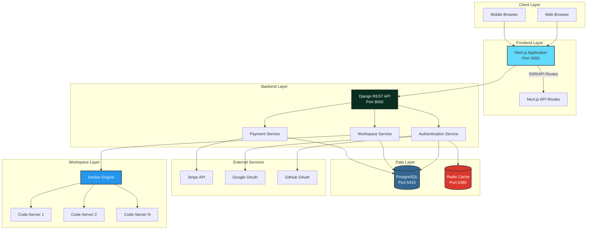

  <h1 style="font-size: 3.5em; margin-bottom: 10px; background: linear-gradient(135deg, #667eea 0%, #764ba2 100%); -webkit-background-clip: text; -webkit-text-fill-color: transparent; background-clip: text;">🎓 ApraNova LMS</h1>
  <h2 style="font-size: 1.8em; color: #2c3e50; font-weight: 400; margin-top: 0;">Modern Learning Management System</h2>
  

    Complete technical documentation for a cloud-native LMS with Docker workspaces, JWT authentication, and integrated payments
  

  <h3 style="margin-top: 0; color: white; font-size: 1.8em;">🚀 What is ApraNova?</h3>
  

    ApraNova is a <strong>cloud-native Learning Management System</strong> that provides students with isolated,
    Docker-based VS Code workspaces, integrated payment processing, and multi-role authentication.
    Built with Django REST Framework and Next.js for maximum scalability and performance.
  

  

    

      
🐳

      
Docker Workspaces

      
Isolated environments

    

    

      
🔐

      
JWT + OAuth

      
Secure authentication

    

    

      
💳

      
Stripe Payments

      
Integrated billing

    

  

---

## 📚 Documentation Navigation

  <h3 style="color: #3498db; margin-top: 0; font-size: 1.5em; display: flex; align-items: center; gap: 10px;">
    🏗️ Architecture & Design
  </h3>
  <ul style="list-style: none; padding-left: 0;">
    <li style="margin-bottom: 18px; padding-left: 25px; position: relative;">
      📐
      <a href="./architecture.html" style="font-weight: 600; font-size: 1.05em; color: #2c3e50; text-decoration: none;">System Architecture</a> 
      <small style="color: #7f8c8d; line-height: 1.6;">Complete system overview with interactive diagrams</small>
    </li>
    <li style="margin-bottom: 18px; padding-left: 25px; position: relative;">
      🗄️
      <a href="./database-schema.html" style="font-weight: 600; font-size: 1.05em; color: #2c3e50; text-decoration: none;">Database Schema</a> 
      <small style="color: #7f8c8d; line-height: 1.6;">ERD diagrams and table relationships</small>
    </li>
    <li style="margin-bottom: 0; padding-left: 25px; position: relative;">
      📡
      <a href="./api-documentation.html" style="font-weight: 600; font-size: 1.05em; color: #2c3e50; text-decoration: none;">API Documentation</a> 
      <small style="color: #7f8c8d; line-height: 1.6;">Complete REST API reference with examples</small>
    </li>
  </ul>

  <h3 style="color: #9b59b6; margin-top: 0; font-size: 1.5em; display: flex; align-items: center; gap: 10px;">
    🔄 Flow Diagrams
  </h3>
  <ul style="list-style: none; padding-left: 0;">
    <li style="margin-bottom: 18px; padding-left: 25px; position: relative;">
      🔐
      <a href="./auth-flow.html" style="font-weight: 600; font-size: 1.05em; color: #2c3e50; text-decoration: none;">Authentication Flow</a> 
      <small style="color: #7f8c8d; line-height: 1.6;">JWT, OAuth, and social login flows</small>
    </li>
    <li style="margin-bottom: 18px; padding-left: 25px; position: relative;">
      🐳
      <a href="./workspace-flow.html" style="font-weight: 600; font-size: 1.05em; color: #2c3e50; text-decoration: none;">Workspace Provisioning</a> 
      <small style="color: #7f8c8d; line-height: 1.6;">Docker-in-Docker workspace creation</small>
    </li>
    <li style="margin-bottom: 0; padding-left: 25px; position: relative;">
      💳
      <a href="./payment-flow.html" style="font-weight: 600; font-size: 1.05em; color: #2c3e50; text-decoration: none;">Payment Processing</a> 
      <small style="color: #7f8c8d; line-height: 1.6;">Stripe integration and payment flows</small>
    </li>
  </ul>

---

## 🚀 Quick Start

  

    

      
📦 GitHub Repository

      <a href="https://github.com/prempp/ApraNova" target="_blank" style="color: white; text-decoration: underline;">github.com/prempp/ApraNova</a>
    

    

      
🔧 Tech Stack

      
Django 5.2.7 • Next.js 15.2.4 • PostgreSQL 14 • Redis 7

    

  

---

## 🏗️ System Overview

  <h3 style="margin-top: 0; color: #d35400; font-size: 1.6em;">💡 Key Features</h3>
  

    

      
👥

      
Multi-Role Authentication

      
Student, Trainer, Admin, SuperAdmin

    

    

      
🐳

      
Docker-Based Workspaces

      
Isolated VS Code environments

    

    

      
💳

      
Payment Integration

      
Stripe payment processing

    

    

      
🔐

      
OAuth Support

      
Google and GitHub authentication

    

    

      
⚡

      
Real-time Updates

      
WebSocket support for notifications

    

    

      
📈

      
Scalable Architecture

      
Microservices-ready design

    

  

---

## 🛠️ Technology Stack

  <h3 style="margin-top: 0; color: white; font-size: 1.4em; border-bottom: 2px solid rgba(255,255,255,0.3); padding-bottom: 10px;">⚙️ Backend</h3>
  <ul style="list-style: none; padding-left: 0; margin-top: 15px;">
    <li style="margin-bottom: 10px; padding-left: 20px; position: relative;">
      •
      <strong>Framework:</strong> Django 5.2.7 + DRF
    </li>
    <li style="margin-bottom: 10px; padding-left: 20px; position: relative;">
      •
      <strong>Database:</strong> PostgreSQL 14
    </li>
    <li style="margin-bottom: 10px; padding-left: 20px; position: relative;">
      •
      <strong>Cache:</strong> Redis 7
    </li>
    <li style="margin-bottom: 10px; padding-left: 20px; position: relative;">
      •
      <strong>Authentication:</strong> JWT + OAuth 2.0
    </li>
    <li style="margin-bottom: 10px; padding-left: 20px; position: relative;">
      •
      <strong>Payment:</strong> Stripe API
    </li>
    <li style="margin-bottom: 0; padding-left: 20px; position: relative;">
      •
      <strong>Containers:</strong> Docker + DinD
    </li>
  </ul>

  <h3 style="margin-top: 0; font-size: 1.4em; border-bottom: 2px solid rgba(0,0,0,0.1); padding-bottom: 10px;">⚛️ Frontend</h3>
  <ul style="list-style: none; padding-left: 0; margin-top: 15px;">
    <li style="margin-bottom: 10px; padding-left: 20px; position: relative;">
      •
      <strong>Framework:</strong> Next.js 15.2.4
    </li>
    <li style="margin-bottom: 10px; padding-left: 20px; position: relative;">
      •
      <strong>UI Library:</strong> React 19 + Tailwind
    </li>
    <li style="margin-bottom: 10px; padding-left: 20px; position: relative;">
      •
      <strong>State:</strong> React Context API
    </li>
    <li style="margin-bottom: 10px; padding-left: 20px; position: relative;">
      •
      <strong>HTTP Client:</strong> Axios
    </li>
    <li style="margin-bottom: 0; padding-left: 20px; position: relative;">
      •
      <strong>Auth Storage:</strong> localStorage
    </li>
  </ul>

  <h3 style="margin-top: 0; color: white; font-size: 1.4em; border-bottom: 2px solid rgba(255,255,255,0.3); padding-bottom: 10px;">🏗️ Infrastructure</h3>
  <ul style="list-style: none; padding-left: 0; margin-top: 15px;">
    <li style="margin-bottom: 10px; padding-left: 20px; position: relative;">
      •
      <strong>Orchestration:</strong> Docker Compose
    </li>
    <li style="margin-bottom: 10px; padding-left: 20px; position: relative;">
      •
      <strong>Web Server:</strong> Gunicorn + Node.js
    </li>
    <li style="margin-bottom: 10px; padding-left: 20px; position: relative;">
      •
      <strong>Reverse Proxy:</strong> Nginx
    </li>
    <li style="margin-bottom: 0; padding-left: 20px; position: relative;">
      •
      <strong>Code Server:</strong> VS Code in browser
    </li>
  </ul>

---

## 📊 System Architecture Diagram

---

## 🔐 Security Features

- **JWT Authentication**: Secure token-based authentication
- **CORS Protection**: Configured allowed origins
- **CSRF Protection**: Django CSRF middleware
- **Password Hashing**: bcrypt password hashing
- **Role-Based Access Control**: Fine-grained permissions
- **Docker Isolation**: Isolated workspace environments
- **HTTPS Ready**: SSL/TLS support in production

---

## 📈 Performance Features

- **Redis Caching**: Fast data retrieval
- **Database Indexing**: Optimized queries
- **Static File Serving**: WhiteNoise for static files
- **Connection Pooling**: Database connection optimization
- **Lazy Loading**: Frontend code splitting
- **Docker Volumes**: Persistent data storage

---

## 🎯 Key Features

### For Students
- Personal dashboard with course progress
- Docker-based VS Code workspace
- Project submission system
- Real-time notifications
- Payment integration for courses

### For Trainers
- Student management dashboard
- Assignment creation and grading
- Progress tracking
- Batch management

### For Admins
- User management
- System configuration
- Analytics and reporting
- Payment management

---

## 📞 Support & Contact

- **Documentation Issues**: [GitHub Issues](https://github.com/your-org/apranova/issues)
- **Email Support**: support@apranova.com
- **Community**: [Discord Server](https://discord.gg/apranova)

---

## 📄 License

This project is licensed under the MIT License - see the [LICENSE](../LICENSE) file for details.

---

**Last Updated**: {{ site.time | date: '%B %d, %Y' }}

**Version**: 1.0.0

