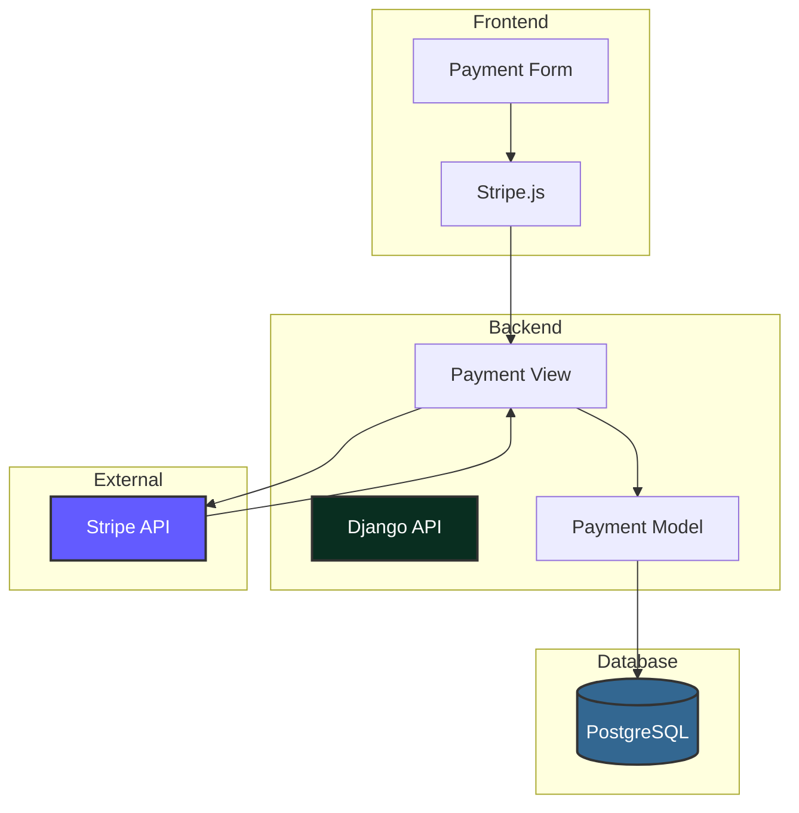
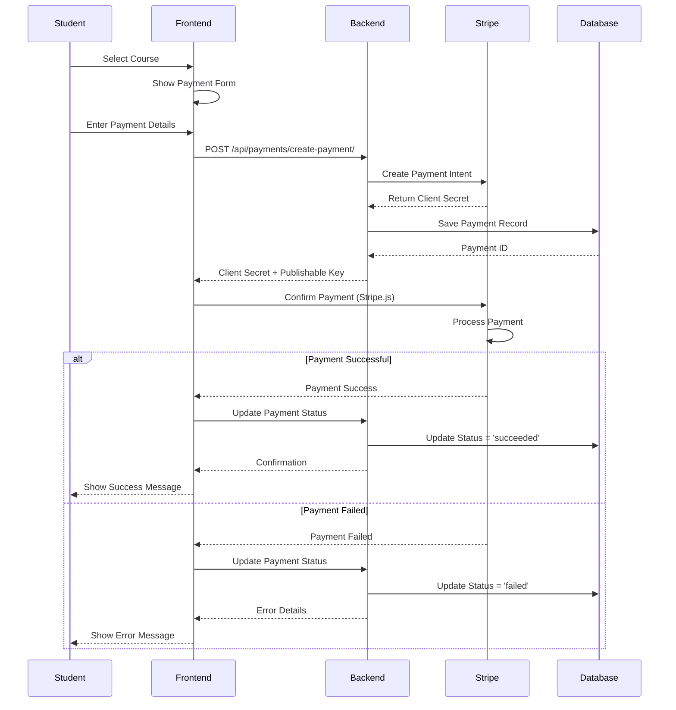
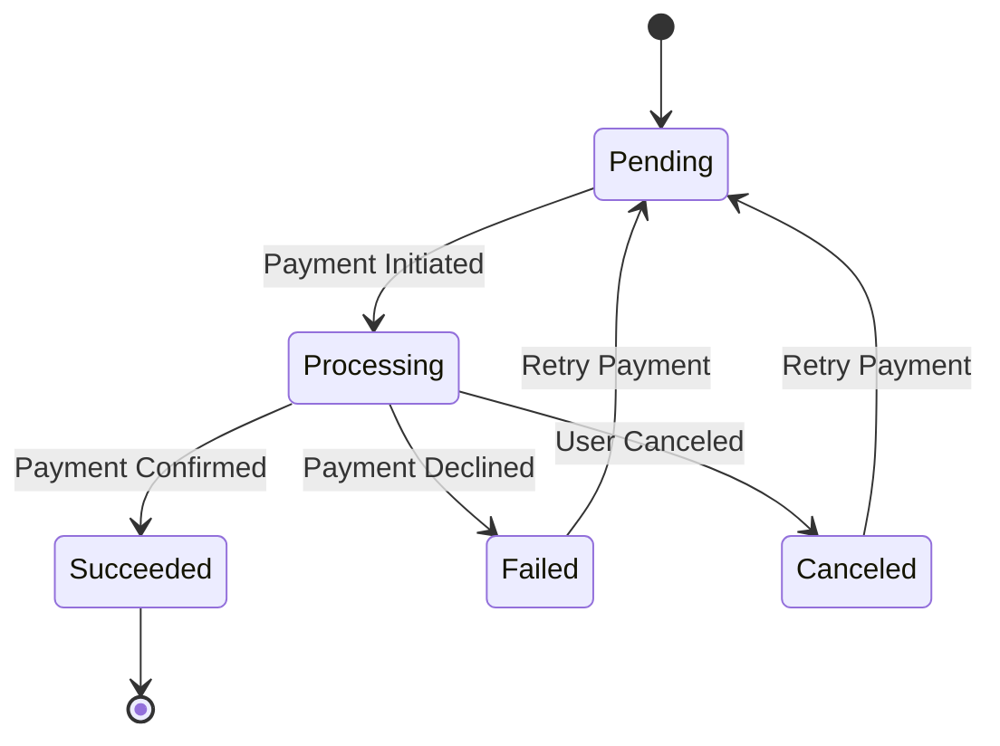

<div style="text-align: center; padding: 30px 0 20px 0;">
  <h1 style="font-size: 3em; margin-bottom: 10px; background: linear-gradient(135deg, #e74c3c 0%, #c0392b 100%); -webkit-background-clip: text; -webkit-text-fill-color: transparent; background-clip: text;">💳 Payment Processing</h1>
  <p style="font-size: 1.2em; color: #7f8c8d; max-width: 700px; margin: 0 auto;">
    Stripe payment integration and processing flows in ApraNova LMS
  </p>
</div>

<div style="background: linear-gradient(135deg, #e74c3c 0%, #c0392b 100%); padding: 30px; border-radius: 12px; color: white; margin: 30px 0; box-shadow: 0 8px 25px rgba(231, 76, 60, 0.3);">
  <h3 style="margin-top: 0; color: white; font-size: 1.6em;">💰 Payment Overview</h3>
  <p style="font-size: 1.1em; line-height: 1.7; margin-bottom: 15px;">
    ApraNova uses <strong>Stripe</strong> for secure payment processing with support for multiple payment methods,
    currencies, and real-time webhook notifications for payment status updates.
  </p>
  <div style="display: grid; grid-template-columns: repeat(auto-fit, minmax(180px, 1fr)); gap: 15px; margin-top: 20px;">
    <div style="background: rgba(255,255,255,0.15); padding: 15px; border-radius: 8px; backdrop-filter: blur(10px);">
      <div style="font-size: 1.8em; margin-bottom: 5px;">💵</div>
      <div style="font-weight: 600;">One-time Payments</div>
      <div style="font-size: 0.9em; opacity: 0.9;">Course enrollment</div>
    </div>
    <div style="background: rgba(255,255,255,0.15); padding: 15px; border-radius: 8px; backdrop-filter: blur(10px);">
      <div style="font-size: 1.8em; margin-bottom: 5px;">🔒</div>
      <div style="font-weight: 600;">Payment Intents</div>
      <div style="font-size: 0.9em; opacity: 0.9;">Secure confirmation</div>
    </div>
    <div style="background: rgba(255,255,255,0.15); padding: 15px; border-radius: 8px; backdrop-filter: blur(10px);">
      <div style="font-size: 1.8em; margin-bottom: 5px;">🌍</div>
      <div style="font-weight: 600;">Multi-Currency</div>
      <div style="font-size: 0.9em; opacity: 0.9;">USD, INR, EUR</div>
    </div>
    <div style="background: rgba(255,255,255,0.15); padding: 15px; border-radius: 8px; backdrop-filter: blur(10px);">
      <div style="font-size: 1.8em; margin-bottom: 5px;">💳</div>
      <div style="font-weight: 600;">Payment Methods</div>
      <div style="font-size: 0.9em; opacity: 0.9;">Cards, UPI, Wallets</div>
    </div>
    <div style="background: rgba(255,255,255,0.15); padding: 15px; border-radius: 8px; backdrop-filter: blur(10px);">
      <div style="font-size: 1.8em; margin-bottom: 5px;">🔔</div>
      <div style="font-weight: 600;">Webhooks</div>
      <div style="font-size: 0.9em; opacity: 0.9;">Real-time updates</div>
    </div>
  </div>
</div>

---

## 🏗️ Payment Architecture

<div style="background: linear-gradient(135deg, #ffecd2 0%, #fcb69f 100%); padding: 20px; border-radius: 10px; margin: 20px 0;">
  <p style="margin: 0; color: #d35400; font-size: 1.05em;">
    <strong>📌 Security:</strong> All payment processing is handled by Stripe. Card details never touch our servers.
    We use Stripe.js for PCI-compliant payment collection.
  </p>
</div>



---

## 📋 Payment Flow

### Complete Payment Process



---

## 🔧 Implementation Details

### Backend - Create Payment Intent

**Endpoint**: `POST /api/payments/create-payment/`

**Request**:
```json
{
  "amount": 999.00,
  "currency": "usd"
}
```

**Backend Code** (`payments/views.py`):
```python
@api_view(["POST"])
@permission_classes([AllowAny])
def create_payment(request):
    try:
        amount = request.data.get("amount")
        currency = request.data.get("currency", "usd")
        
        # Convert to smallest currency unit (cents/paise)
        amount_cents = int(float(amount) * 100)
        
        # Create Stripe Payment Intent
        intent = stripe.PaymentIntent.create(
            amount=amount_cents,
            currency=currency,
            automatic_payment_methods={"enabled": True},
        )
        
        # Save to database
        Payment.objects.create(
            user=request.user,
            stripe_payment_intent=intent.id,
            amount=amount,
            currency=currency,
            status=intent.status,
        )
        
        return Response({
            "clientSecret": intent.client_secret,
            "publishableKey": settings.STRIPE_PUBLISHABLE_KEY,
        })
    except Exception as e:
        return Response({"error": str(e)}, status=500)
```

**Response**:
```json
{
  "clientSecret": "pi_3KJ..._secret_...",
  "publishableKey": "pk_test_..."
}
```

---

### Frontend - Payment Form

**Payment Component** (React/Next.js):
```typescript
import { loadStripe } from '@stripe/stripe-js';
import { Elements, CardElement, useStripe, useElements } from '@stripe/react-stripe-js';

const PaymentForm = ({ amount, currency }) => {
  const stripe = useStripe();
  const elements = useElements();
  const [loading, setLoading] = useState(false);

  const handleSubmit = async (e) => {
    e.preventDefault();
    setLoading(true);

    // Create payment intent
    const response = await apiClient.post('/payments/create-payment/', {
      amount,
      currency
    });

    const { clientSecret } = response.data;

    // Confirm payment
    const result = await stripe.confirmCardPayment(clientSecret, {
      payment_method: {
        card: elements.getElement(CardElement),
      }
    });

    if (result.error) {
      // Show error
      console.error(result.error.message);
    } else {
      // Payment successful
      console.log('Payment successful!');
    }

    setLoading(false);
  };

  return (
    <form onSubmit={handleSubmit}>
      <CardElement />
      <button type="submit" disabled={!stripe || loading}>
        Pay ${amount}
      </button>
    </form>
  );
};
```

---

## 💾 Database Schema

### Payment Model

```python
class Payment(models.Model):
    user = models.ForeignKey(
        CustomUser, 
        on_delete=models.CASCADE,
        related_name='payments'
    )
    stripe_payment_intent = models.CharField(
        max_length=255, 
        unique=True
    )
    amount = models.DecimalField(
        max_digits=10, 
        decimal_places=2
    )
    currency = models.CharField(
        max_length=3, 
        default='usd'
    )
    status = models.CharField(
        max_length=50,
        choices=[
            ('pending', 'Pending'),
            ('processing', 'Processing'),
            ('succeeded', 'Succeeded'),
            ('failed', 'Failed'),
            ('canceled', 'Canceled'),
        ]
    )
    created_at = models.DateTimeField(auto_now_add=True)
    updated_at = models.DateTimeField(auto_now=True)

    class Meta:
        ordering = ['-created_at']
        indexes = [
            models.Index(fields=['user', 'status']),
            models.Index(fields=['stripe_payment_intent']),
        ]
```

---

## 🔄 Payment States



### Payment Status Descriptions

| Status | Description | Next Action |
|--------|-------------|-------------|
| **Pending** | Payment intent created | Await user action |
| **Processing** | Payment being processed | Wait for confirmation |
| **Succeeded** | Payment completed | Grant access |
| **Failed** | Payment declined | Show error, allow retry |
| **Canceled** | User canceled payment | Allow retry |

---

## 🔐 Security Measures

### PCI Compliance

- **No Card Data Storage**: Card details never touch our servers
- **Stripe.js**: Client-side tokenization
- **HTTPS Only**: All communication encrypted
- **Webhook Verification**: Signed webhook events

### Backend Security

```python
# Environment variables
STRIPE_SECRET_KEY = config("STRIPE_SECRET_KEY")
STRIPE_PUBLISHABLE_KEY = config("STRIPE_PUBLISHABLE_KEY")
STRIPE_WEBHOOK_SECRET = config("STRIPE_WEBHOOK_SECRET")

# Never expose secret key to frontend
# Only send publishable key
```

---

## 🔔 Webhook Integration

### Webhook Handler

```python
@api_view(["POST"])
@permission_classes([AllowAny])
def stripe_webhook(request):
    payload = request.body
    sig_header = request.META.get('HTTP_STRIPE_SIGNATURE')
    
    try:
        event = stripe.Webhook.construct_event(
            payload, sig_header, settings.STRIPE_WEBHOOK_SECRET
        )
    except ValueError:
        return Response(status=400)
    except stripe.error.SignatureVerificationError:
        return Response(status=400)
    
    # Handle event
    if event['type'] == 'payment_intent.succeeded':
        payment_intent = event['data']['object']
        # Update payment status
        Payment.objects.filter(
            stripe_payment_intent=payment_intent['id']
        ).update(status='succeeded')
    
    elif event['type'] == 'payment_intent.payment_failed':
        payment_intent = event['data']['object']
        # Update payment status
        Payment.objects.filter(
            stripe_payment_intent=payment_intent['id']
        ).update(status='failed')
    
    return Response(status=200)
```

### Webhook Events

| Event | Description | Action |
|-------|-------------|--------|
| `payment_intent.created` | Payment intent created | Log event |
| `payment_intent.succeeded` | Payment successful | Grant access |
| `payment_intent.payment_failed` | Payment failed | Notify user |
| `payment_intent.canceled` | Payment canceled | Update status |

---

## 💰 Supported Payment Methods

### Card Payments

- Visa
- Mastercard
- American Express
- Discover
- Diners Club

### Digital Wallets

- Apple Pay
- Google Pay
- Microsoft Pay

### Local Payment Methods (India)

- UPI
- Net Banking
- Wallets (Paytm, PhonePe, etc.)

---

## 🧪 Testing

### Test Cards

| Card Number | Description |
|-------------|-------------|
| `4242 4242 4242 4242` | Successful payment |
| `4000 0000 0000 9995` | Declined payment |
| `4000 0025 0000 3155` | Requires authentication |

### Test Mode

```bash
# Use test API keys
STRIPE_SECRET_KEY=sk_test_...
STRIPE_PUBLISHABLE_KEY=pk_test_...
```

---

## 📊 Payment Analytics

### Track Payments

```python
# Get total revenue
total_revenue = Payment.objects.filter(
    status='succeeded'
).aggregate(
    total=Sum('amount')
)['total']

# Get payments by user
user_payments = Payment.objects.filter(
    user=user,
    status='succeeded'
).order_by('-created_at')

# Get failed payments
failed_payments = Payment.objects.filter(
    status='failed'
).count()
```

---

## 🔗 Related Documentation

- [API Documentation](./api-documentation.md)
- [Database Schema](./database-schema.md)
- [System Architecture](./architecture.md)

---

## 📚 External Resources

- [Stripe Documentation](https://stripe.com/docs)
- [Stripe API Reference](https://stripe.com/docs/api)
- [Stripe Testing](https://stripe.com/docs/testing)

---

[← Back to Index](./index.md)

