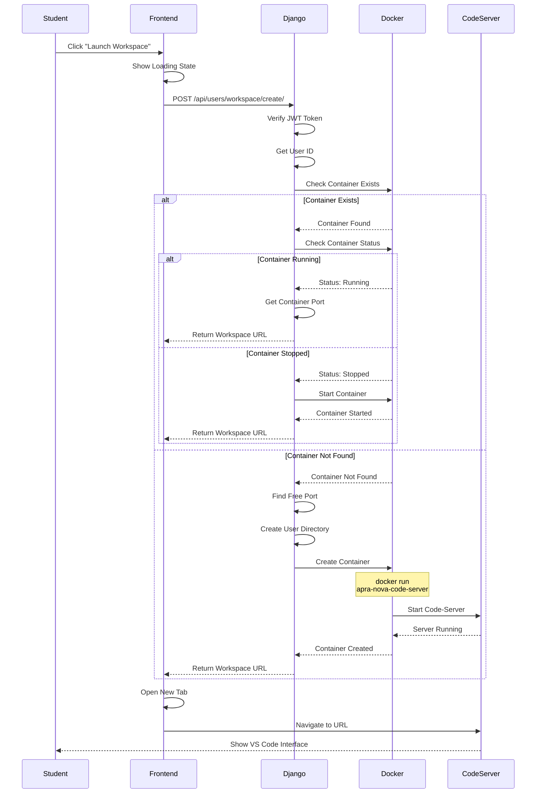
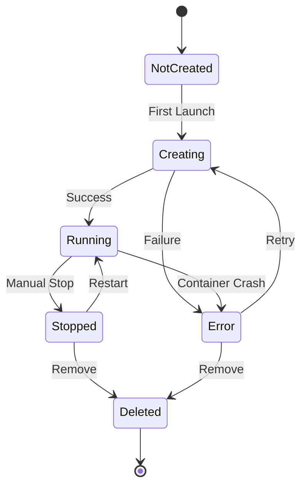
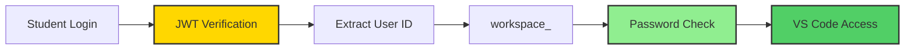

<div style="text-align: center; padding: 30px 0 20px 0;">
  <h1 style="font-size: 3em; margin-bottom: 10px; background: linear-gradient(135deg, #2ecc71 0%, #27ae60 100%); -webkit-background-clip: text; -webkit-text-fill-color: transparent; background-clip: text;">🐳 Workspace Provisioning</h1>
  <p style="font-size: 1.2em; color: #7f8c8d; max-width: 700px; margin: 0 auto;">
    Docker-based workspace provisioning and management in ApraNova LMS
  </p>
</div>

<div style="background: linear-gradient(135deg, #2ecc71 0%, #27ae60 100%); padding: 30px; border-radius: 12px; color: white; margin: 30px 0; box-shadow: 0 8px 25px rgba(46, 204, 113, 0.3);">
  <h3 style="margin-top: 0; color: white; font-size: 1.6em;">🚀 Workspace Overview</h3>
  <p style="font-size: 1.1em; line-height: 1.7; margin-bottom: 15px;">
    ApraNova provides <strong>isolated, Docker-based VS Code environments</strong> (code-server) for each student.
    Each workspace is a separate container with pre-installed development tools and persistent storage.
  </p>
  <div style="display: grid; grid-template-columns: repeat(auto-fit, minmax(180px, 1fr)); gap: 15px; margin-top: 20px;">
    <div style="background: rgba(255,255,255,0.15); padding: 15px; border-radius: 8px; backdrop-filter: blur(10px);">
      <div style="font-size: 1.8em; margin-bottom: 5px;">💻</div>
      <div style="font-weight: 600;">VS Code Browser</div>
      <div style="font-size: 0.9em; opacity: 0.9;">Full IDE experience</div>
    </div>
    <div style="background: rgba(255,255,255,0.15); padding: 15px; border-radius: 8px; backdrop-filter: blur(10px);">
      <div style="font-size: 1.8em; margin-bottom: 5px;">🛠️</div>
      <div style="font-weight: 600;">Pre-installed Tools</div>
      <div style="font-size: 0.9em; opacity: 0.9;">Python, Node, Java, Git</div>
    </div>
    <div style="background: rgba(255,255,255,0.15); padding: 15px; border-radius: 8px; backdrop-filter: blur(10px);">
      <div style="font-size: 1.8em; margin-bottom: 5px;">💾</div>
      <div style="font-weight: 600;">Persistent Storage</div>
      <div style="font-size: 0.9em; opacity: 0.9;">Docker volumes</div>
    </div>
    <div style="background: rgba(255,255,255,0.15); padding: 15px; border-radius: 8px; backdrop-filter: blur(10px);">
      <div style="font-size: 1.8em; margin-bottom: 5px;">🔒</div>
      <div style="font-weight: 600;">Isolated</div>
      <div style="font-size: 0.9em; opacity: 0.9;">Separate containers</div>
    </div>
    <div style="background: rgba(255,255,255,0.15); padding: 15px; border-radius: 8px; backdrop-filter: blur(10px);">
      <div style="font-size: 1.8em; margin-bottom: 5px;">⚡</div>
      <div style="font-weight: 600;">Auto-provisioning</div>
      <div style="font-size: 0.9em; opacity: 0.9;">On-demand creation</div>
    </div>
  </div>
</div>

---

## 🏗️ Workspace Architecture

<div style="background: linear-gradient(135deg, #ffecd2 0%, #fcb69f 100%); padding: 20px; border-radius: 10px; margin: 20px 0;">
  <p style="margin: 0; color: #d35400; font-size: 1.05em;">
    <strong>📌 Architecture:</strong> Uses Docker-in-Docker (DinD) pattern where the Django backend container
    has access to the Docker socket to create and manage student workspace containers.
  </p>
</div>

```mermaid
graph TB
    subgraph "Frontend"
        UI[Student Dashboard]
        WorkspaceButton[Launch Workspace Button]
    end

    subgraph "Backend Container"
        Django[Django API]
        DockerClient[Docker Python SDK]
    end

    subgraph "Docker Host"
        DockerEngine[Docker Engine]
        DockerSocket[/var/run/docker.sock]
    end

    subgraph "Workspace Containers"
        WS1[Workspace 1<br/>User ID: 1<br/>Port: 8081]
        WS2[Workspace 2<br/>User ID: 2<br/>Port: 8082]
        WSN[Workspace N<br/>User ID: N<br/>Port: 808N]
    end

    subgraph "Storage"
        Volume1[User 1 Volume<br/>/app/workspaces/1]
        Volume2[User 2 Volume<br/>/app/workspaces/2]
        VolumeN[User N Volume<br/>/app/workspaces/N]
    end

    UI --> WorkspaceButton
    WorkspaceButton --> Django
    Django --> DockerClient
    DockerClient --> DockerSocket
    DockerSocket --> DockerEngine
    
    DockerEngine --> WS1
    DockerEngine --> WS2
    DockerEngine --> WSN
    
    WS1 --> Volume1
    WS2 --> Volume2
    WSN --> VolumeN

    style Django fill:#092e20,stroke:#333,stroke-width:2px,color:#fff
    style DockerEngine fill:#2496ed,stroke:#333,stroke-width:2px,color:#fff
    style WS1 fill:#007acc,stroke:#333,stroke-width:2px,color:#fff
    style WS2 fill:#007acc,stroke:#333,stroke-width:2px,color:#fff
    style WSN fill:#007acc,stroke:#333,stroke-width:2px,color:#fff
```

---

## 📋 Workspace Creation Flow



---

## 🔧 Container Configuration

### Docker Run Command

```bash
docker run \
  --name workspace_<user_id> \
  --detach \
  --restart unless-stopped \
  --network apranova_network \
  --publish <dynamic_port>:8080 \
  --env PASSWORD=<user_id>_workspace \
  --volume /app/workspaces/<user_id>:/home/coder/project \
  apra-nova-code-server:latest
```

### Container Specifications

| Parameter | Value | Description |
|-----------|-------|-------------|
| **Image** | `apra-nova-code-server:latest` | Custom code-server image |
| **Name** | `workspace_<user_id>` | Unique container name |
| **Port** | Dynamic (8081-9999) | Mapped to container port 8080 |
| **Network** | `apranova_network` | Docker network |
| **Volume** | `/app/workspaces/<user_id>` | Persistent storage |
| **Password** | `<user_id>_workspace` | Access password |
| **Restart Policy** | `unless-stopped` | Auto-restart on failure |

---

## 🐳 Code-Server Image

### Dockerfile

```dockerfile
FROM codercom/code-server:latest

USER root

# Install development tools
RUN apt-get update && apt-get install -y \
    python3 \
    python3-pip \
    nodejs \
    npm \
    openjdk-11-jdk \
    gcc \
    g++ \
    make \
    git \
    curl \
    wget \
    && rm -rf /var/lib/apt/lists/*

# Install Python packages
RUN pip3 install --no-cache-dir \
    django \
    flask \
    numpy \
    pandas \
    requests

# Install Node.js packages globally
RUN npm install -g \
    typescript \
    nodemon \
    express

# Set working directory
WORKDIR /home/coder/project

# Expose code-server port
EXPOSE 8080

USER coder
```

### Pre-installed Tools

- **Languages**: Python 3, Node.js, Java 11, C/C++
- **Frameworks**: Django, Flask, Express
- **Libraries**: NumPy, Pandas, TypeScript
- **Tools**: Git, curl, wget, make
- **Editor**: VS Code with extensions

---

## 🔄 Workspace Lifecycle



### Lifecycle States

| State | Description | Actions Available |
|-------|-------------|-------------------|
| **Not Created** | No container exists | Create |
| **Creating** | Container being provisioned | Wait |
| **Running** | Container active and accessible | Access, Stop |
| **Stopped** | Container exists but not running | Start, Delete |
| **Error** | Container failed to start | Retry, Delete |
| **Deleted** | Container removed | Create New |

---

## 📊 Port Management

### Dynamic Port Allocation

```python
def get_free_port():
    """Find an available port for workspace"""
    import socket
    with socket.socket(socket.AF_INET, socket.SOCK_STREAM) as s:
        s.bind(('', 0))
        s.listen(1)
        port = s.getsockname()[1]
    return port
```

### Port Range

- **Start**: 8081
- **End**: 9999
- **Total Available**: ~1900 ports
- **Concurrent Workspaces**: Up to 1900 students

---

## 💾 Storage Management

### Volume Structure

```
/app/workspaces/
├── 1/                    # User ID 1
│   ├── project1/
│   ├── project2/
│   └── settings.json
├── 2/                    # User ID 2
│   ├── assignment1/
│   └── notes.md
└── N/                    # User ID N
    └── ...
```

### Storage Specifications

- **Type**: Docker Named Volume
- **Location**: `/app/workspaces/<user_id>`
- **Mount Point**: `/home/coder/project` (in container)
- **Persistence**: Data survives container restarts
- **Isolation**: Each user has separate volume

---

## 🔐 Security Measures

### Container Isolation

1. **Network Isolation**: Containers on separate network
2. **Resource Limits**: CPU and memory constraints
3. **User Permissions**: Non-root user inside container
4. **Password Protection**: Each workspace password-protected
5. **Volume Isolation**: Separate volumes per user

### Access Control



---

## 🛠️ Workspace Management API

### Create/Get Workspace

**Endpoint**: `POST /api/users/workspace/create/`

**Headers**:
```
Authorization: Bearer <access_token>
```

**Response** (New Workspace):
```json
{
  "url": "http://localhost:8081",
  "port": 8081,
  "msg": "Workspace created successfully."
}
```

**Response** (Existing Workspace):
```json
{
  "url": "http://localhost:8081"
}
```

**Error Response**:
```json
{
  "error": "Workspace feature not available",
  "message": "Docker is not accessible from the backend container.",
  "details": "Please contact your administrator."
}
```

---

## 🔍 Monitoring & Debugging

### Check Workspace Status

```bash
# List all workspace containers
docker ps --filter "name=workspace_"

# Check specific workspace
docker ps --filter "name=workspace_1"

# View workspace logs
docker logs workspace_1

# Inspect workspace
docker inspect workspace_1
```

### Common Issues

| Issue | Cause | Solution |
|-------|-------|----------|
| Container won't start | Port already in use | Restart container with new port |
| Can't access workspace | Firewall blocking port | Open port in firewall |
| Files not persisting | Volume not mounted | Check volume configuration |
| Slow performance | Resource limits | Increase CPU/memory limits |

---

## 📈 Performance Optimization

### Resource Limits

```python
container = client.containers.run(
    "apra-nova-code-server:latest",
    # ... other params ...
    mem_limit="2g",           # 2GB RAM limit
    cpu_quota=50000,          # 50% CPU limit
    storage_opt={
        "size": "10G"         # 10GB storage limit
    }
)
```

### Cleanup Strategy

```python
# Stop inactive workspaces after 24 hours
# Remove stopped workspaces after 7 days
# Archive user data before deletion
```

---

## 🔄 Backup & Recovery

### Backup User Workspace

```bash
# Backup user workspace data
docker run --rm \
  --volumes-from workspace_1 \
  -v $(pwd):/backup \
  alpine tar czf /backup/workspace_1_backup.tar.gz /home/coder/project
```

### Restore User Workspace

```bash
# Restore user workspace data
docker run --rm \
  --volumes-from workspace_1 \
  -v $(pwd):/backup \
  alpine tar xzf /backup/workspace_1_backup.tar.gz -C /
```

---

## 🔗 Related Documentation

- [System Architecture](./architecture.md)
- [API Documentation](./api-documentation.md)
- [Docker Setup](./docker-setup.md)

---

[← Back to Index](./index.md)

